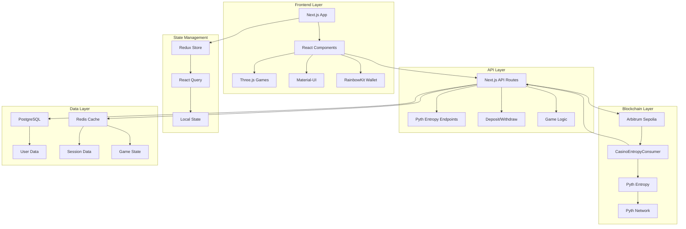
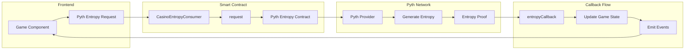
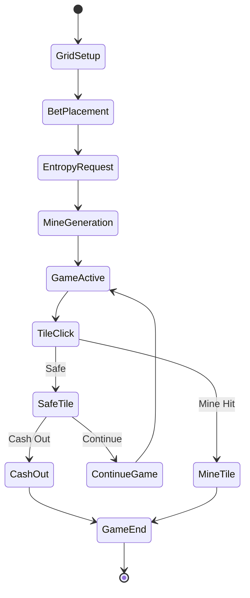
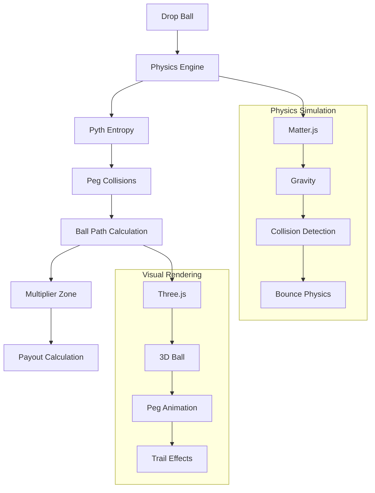
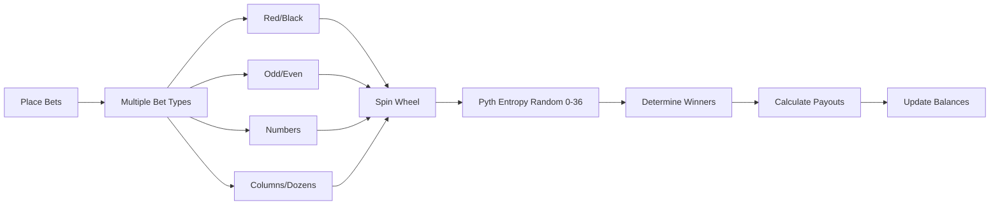
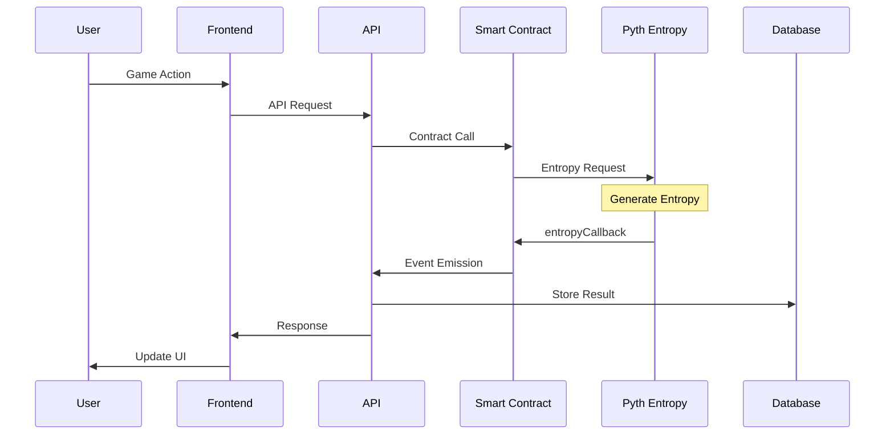
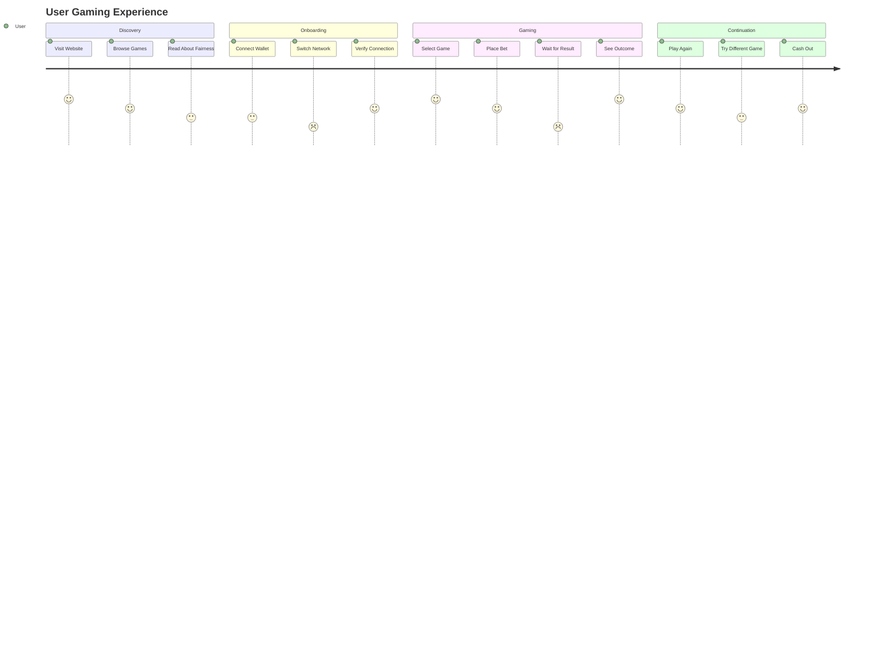

# 🎲 APT-Casino – Fully On-Chain Casino built using Pyth Entropy

A couple of days back, I was was on etherscan exploring some transactions and saw an advertisement of https://stake.com/ which was giving 200% bonus on first deposit, I deposited 120 USDT into stake.com they gave 360 USDT as total balance in their controlled custodial wallet and when I started playing casino games I was shocked to see that I was only able to play with $1 per game and was unable to increase the betting amount beyond $1 coz and when I tried to explore and play other games on the platform the issue was persisting, I reached the customer support and got to know that this platform has cheated him under the name of wager limits as I was using the bonus scheme of 200%.

When I asked the customer support to withdraw money they showed a rule list of wager limit, which said that if I wanted to withdraw the deposited amount, then I have to play $12,300 worth of gameplay and this was a big shock for me, as I was explained a maths logic by their live support. Thereby, In the hope of getting the deposited money back, I played the different games of stake.com like roulette, mines, spin wheel, etc, the entire night and lost all the money.

I was very annoyed of that's how APT-Casino was born, all in one platform where new web3 users can play games, perform gambling, but have a safe, secure, transparent platform that does not scam any of their users. Also, I wanted to address common issues in traditional gambling platforms.

---

## 🚨 Problems with Traditional Online Casinos

The online gambling industry is plagued by:
- **Unfair Game Outcomes**: 99% of platforms manipulate results with black-box RNG.  
- **Restrictive Withdrawal Policies**: Locking user funds behind unreasonable wagering requirements.  
- **Bonus Drawbacks**: Misleading promos designed to trap users.  
- **Lack of True Asset Ownership**: Centralized custody means players don’t actually control their assets.  
- **Poor Web3 Adoption UX**: Wallet complexity scares Web2 users away.  
- **No Social Layer**: No live streaming, no chat, no community-driven experience.  

---

## ✅ APT-Casino Solution

We fix these problems with **trustless infrastructure**:

- **Provably Fair Gaming**
  All outcomes are powered by **PYTH Entropy**, providing cryptographically verifiable randomness on-chain.

  

- **Flexible Withdrawals**  
  Users can withdraw funds **anytime without hidden conditions**.  

- **Transparent Bonus Schemes**  
  Clear terms, no hidden traps, no fake promos.  

- **True Asset Ownership**  
  Funds are non-custodial. 

- **Gasless UX**  
  Meta-transactions abstract gas fees, paid by our treasury. Users play like Web2, but with Web3 transparency.  

- **Live Streaming**  
  Powered by **Livepeer**, enabling real-time game broadcasts, tournaments, and even live dealer streams.  

- **On-Chain Chat**  
  Built with **Socket.IO** + wallet-signed messages → verifiable, censorship-resistant real-time player interactions.  

---

## 🧩 Modular Casino Primitives

APT-Casino games are built as **composable smart contract modules**:
- **Provably fair** – randomness via Pyth Entropy.  
- **Gas-efficient** – L2 execution on Arbitrum.  
- **Composable** – shared liquidity & risk primitives.  
- **Extensible** – future RNG providers, payment rails, and account abstraction ready.  

---

## 🎮 Games

### 🎡 Roulette (European)
- **Bets Supported**: Straight, Split, Street, Corner, Line, Dozen, Column, Red/Black, Odd/Even, High/Low.  
- **Resolution**: `n = randomWord % 37`.  
- **Fairness**: Uniform distribution, payouts 35:1 → 1:1.  
- **Edge**: Encoded via payout schedule, never manipulated.  

---

### 💣 Mines
- **Grid**: 5×5, 1–24 mines per round.  
- **Placement**: Derived via Fisher-Yates shuffle seeded with entropy.  
- **Mechanics**: Cash out anytime; multiplier curve increases with risk.  

---

### 🪂 Plinko
- **Mechanics**: Balls fall through entropy-seeded paths.  
- **Multipliers**: 0.2× to 100× depending on slot depth.  
- **Risk Modes**: Low, medium, high → adjust distribution tail weight.  

---

### 🌀 Spin Wheel
- **Segments**: Each outcome = `randomWord % N`.  
- **Risk Levels**: Low (1.2–2×), Medium (2–5×), High (5–20×).  
- **Fairness**: Pyth entropy ensures verifiable randomness for each spin.  

---

## ⚔️ Architecture

# APT Casino - Mermaid Architecture Diagrams

## 🏗️ System Architecture Overview

## 🎲 Pyth Entropy Integration Architecture

## 🎯 Game-Specific Flows

### Mines Game Flow

### Plinko Game Flow

### Roulette Game Flow

## 🔄 Request-Response Cycle

## 🎯 User Journey Flow

