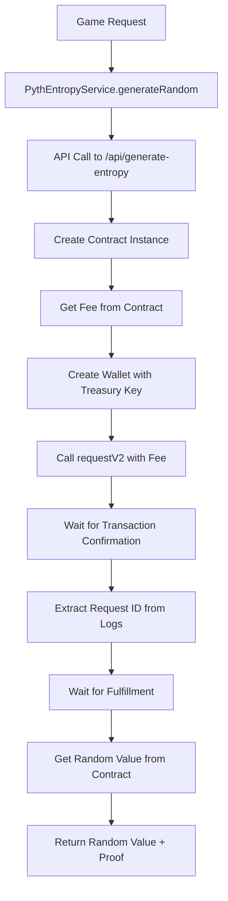
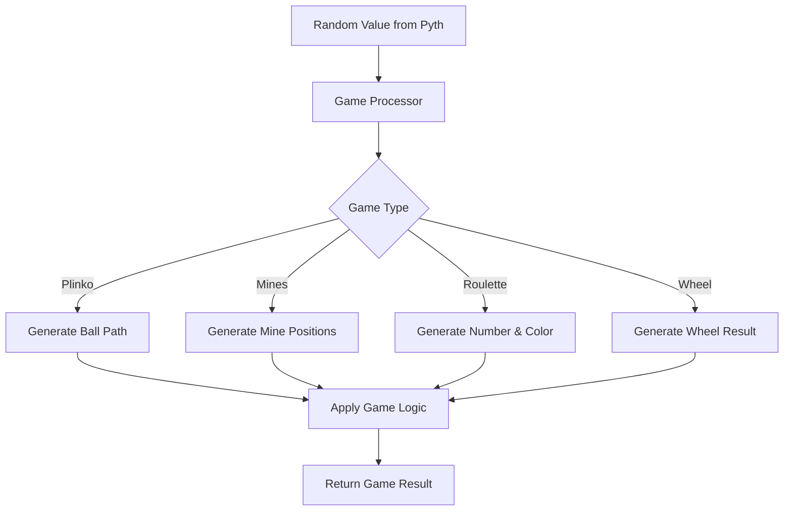

# 🎲 APT-Casino – Fully On-Chain Casino built using Pyth Entropy

A couple of days back, I was was on etherscan exploring some transactions and saw an advertisement of https://stake.com/ which was giving 200% bonus on first deposit, I deposited 120 USDT into stake.com they gave 360 USDT as total balance in their controlled custodial wallet and when I started playing casino games I was shocked to see that I was only able to play with $1 per game and was unable to increase the betting amount beyond $1 coz and when I tried to explore and play other games on the platform the issue was persisting, I reached the customer support and got to know that this platform has cheated him under the name of wager limits as I was using the bonus scheme of 200%.

When I asked the customer support to withdraw money they showed a rule list of wager limit, which said that if I wanted to withdraw the deposited amount, then I have to play $12,300 worth of gameplay and this was a big shock for me, as I was explained a maths logic by their live support. Thereby, In the hope of getting the deposited money back, I played the different games of stake.com like roulette, mines, spin wheel, etc, the entire night and lost all the money.

I was very annoyed of that's how APT-Casino was born, all in one platform where new web3 users can play games, perform gambling, but have a safe, secure, transparent platform that does not scam any of their users. Also, I wanted to address common issues in traditional gambling platforms.

---

## 🚨 Problems with Traditional Online Casinos

The online gambling industry is plagued by:
- **Unfair Game Outcomes**: 99% of platforms manipulate results with black-box RNG.  
- **Restrictive Withdrawal Policies**: Locking user funds behind unreasonable wagering requirements.  
- **Bonus Drawbacks**: Misleading promos designed to trap users.  
- **Lack of True Asset Ownership**: Centralized custody means players don’t actually control their assets.  
- **Poor Web3 Adoption UX**: Wallet complexity scares Web2 users away.  
- **No Social Layer**: No live streaming, no chat, no community-driven experience.  

---

## ✅ APT-Casino Solution

We fix these problems with **trustless infrastructure**:

- **Provably Fair Gaming**
  All outcomes are powered by **PYTH Entropy**, providing cryptographically verifiable randomness on-chain.

  


- **Flexible Withdrawals**  
  Users can withdraw funds **anytime without hidden conditions**.  

- **Transparent Bonus Schemes**  
  Clear terms, no hidden traps, no fake promos.  

- **True Asset Ownership**  
  Funds are non-custodial. 

- **Gasless UX**  
  Meta-transactions abstract gas fees, paid by our treasury. Users play like Web2, but with Web3 transparency.  

- **Live Streaming**  
  Powered by **Livepeer**, enabling real-time game broadcasts, tournaments, and even live dealer streams.  

- **On-Chain Chat**  
  Built with **Socket.IO** + wallet-signed messages → verifiable, censorship-resistant real-time player interactions.  

---

## 🧩 Modular Casino Primitives

APT-Casino games are built as **composable smart contract modules**:
- **Provably fair** – randomness via Pyth Entropy.  
- **Gas-efficient** – L2 execution on Arbitrum.  
- **Composable** – shared liquidity & risk primitives.  
- **Extensible** – future RNG providers, payment rails, and account abstraction ready.  

---

## 🎮 Games

### 🎡 Roulette (European)
- **Bets Supported**: Straight, Split, Street, Corner, Line, Dozen, Column, Red/Black, Odd/Even, High/Low.  
- **Resolution**: `n = randomWord % 37`.  
- **Fairness**: Uniform distribution, payouts 35:1 → 1:1.  
- **Edge**: Encoded via payout schedule, never manipulated.  

---

### 💣 Mines
- **Grid**: 5×5, 1–24 mines per round.  
- **Placement**: Derived via Fisher-Yates shuffle seeded with entropy.  
- **Mechanics**: Cash out anytime; multiplier curve increases with risk.  

---

### 🪂 Plinko
- **Mechanics**: Balls fall through entropy-seeded paths.  
- **Multipliers**: 0.2× to 100× depending on slot depth.  
- **Risk Modes**: Low, medium, high → adjust distribution tail weight.  

---

### 🌀 Spin Wheel
- **Segments**: Each outcome = `randomWord % N`.  
- **Risk Levels**: Low (1.2–2×), Medium (2–5×), High (5–20×).  
- **Fairness**: Pyth entropy ensures verifiable randomness for each spin.  

---

## ⚔️ Architecture


# APT Casino - Mermaid Architecture Diagrams

## 🏗️ System Architecture Overview


## 🎲 Pyth Entropy Integration Architecture


## 🎯 Game-Specific Flows

### Mines Game Flow


### Plinko Game Flow


### Roulette Game Flow


## 🔄 Request-Response Cycle


## 🎯 User Journey Flow


# Pyth Entropy Randomness Logic Documentation

## Overview
This document explains the complete Pyth Entropy randomness implementation in the APT Casino project. The system uses Pyth Network's entropy service to generate verifiable random numbers for casino games.

## Architecture

### 1. Core Service Layer
**File: `src/services/PythEntropyService.js`**

The main service that handles all Pyth Entropy interactions:

```javascript
class PythEntropyService {
  constructor() {
    this.contractABI = [
      "function requestV2(uint32 gasLimit) external payable returns (uint64)",
      "function getRandomValue(bytes32 requestId) external view returns (bytes32)",
      "function isRequestFulfilled(bytes32 requestId) external view returns (bool)",
      "function getRequest(bytes32 requestId) external view returns (bool, bytes32, uint64, uint256)",
      "function getFeeV2(uint32 gasLimit) external view returns (uint256)",
      "event RandomnessRequested(bytes32 indexed requestId, address indexed provider, bytes32 userRandomNumber, uint64 sequenceNumber, address requester)",
      "event RandomnessFulfilled(bytes32 indexed requestId, bytes32 randomValue)"
    ];
  }
```

**Key Methods:**
- `generateRandom(gameType, gameConfig)` - Main method to generate random numbers
- `initialize(network)` - Initialize the service with network configuration
- `waitForFulfillment(requestId)` - Wait for entropy request to be fulfilled
- `extractRequestIdFromLogs(logs)` - Extract request ID from transaction logs

### 2. API Layer
**File: `src/app/api/generate-entropy/route.js`**

The API endpoint that directly interacts with Pyth Entropy contract:

```javascript
export async function POST(request) {
  // Create provider and contract instance
  const provider = new ethers.JsonRpcProvider(ARBITRUM_SEPOLIA_RPC);
  const contract = new ethers.Contract(PYTH_ENTROPY_ADDRESS, PYTH_ENTROPY_ABI, provider);
  
  // Get fee and create wallet
  const fee = await contract.getFeeV2(200000);
  const wallet = new ethers.Wallet(privateKey, provider);
  
  // Request random value
  const tx = await contractWithSigner.requestV2(200000, {
    value: fee,
    gasLimit: 500000
  });
  
  // Extract request ID and get random value
  const requestId = extractRequestIdFromLogs(receipt.logs);
  const randomValue = await contract.getRandomValue(requestId);
}
```

### 3. Configuration
**File: `src/config/pythEntropy.js`**

Network and contract configuration:

```javascript
export const PYTH_ENTROPY_CONFIG = {
  NETWORKS: {
    'arbitrum-sepolia': {
      chainId: 421614,
      entropyContract: '0x549ebba8036ab746611b4ffa1423eb0a4df61440',
      entropyProvider: '0x6CC14824Ea2918f5De5C2f75A9Da968ad4BD6344',
      rpcUrl: 'https://sepolia-rollup.arbitrum.io/rpc'
    }
  }
};
```

## Game-Specific Processors

### 1. Plinko Game Processor
**File: `src/services/gameProcessors/PlinkoResultProcessor.js`**

Converts entropy values into ball paths for Plinko game:

```javascript
processEntropy(entropyValue, gameConfig) {
  const entropyBigInt = typeof entropyValue === 'string' ? BigInt(entropyValue) : entropyValue;
  
  // Generate ball path with controlled randomness
  const ballPath = this.generateBallPath(entropyBigInt, rows);
  
  // Calculate final position
  const finalPosition = this.calculateFinalPosition(ballPath);
  
  return {
    gameType: 'PLINKO',
    ballPath,
    finalPosition,
    payoutMultiplier: multipliers[finalPosition]
  };
}

generateBallPath(entropyValue, rows) {
  const path = [];
  let seed = entropyValue;
  
  for (let row = 0; row < rows; row++) {
    // Use controlled randomness to prevent extreme outcomes
    const rawRandom = Number(seed % BigInt(1000));
    
    // Apply bias towards center
    const centerBias = this.calculateCenterBias(row, rows);
    const biasedRandom = this.applyBias(rawRandom, centerBias);
    
    // Determine direction (0 = left, 1 = right)
    const direction = biasedRandom < 500 ? 0 : 1;
    path.push(direction);
    
    // Update seed for next iteration
    seed = seed / BigInt(1000);
  }
  
  return path;
}
```

### 2. Mines Game Processor
**File: `src/services/gameProcessors/MinesResultProcessor.js`**

Generates mine positions using Fisher-Yates shuffle:

```javascript
processEntropy(entropyValue, gameConfig) {
  const entropyBigInt = typeof entropyValue === 'string' ? BigInt(entropyValue) : entropyValue;
  
  // Generate mine positions using Fisher-Yates shuffle
  const minePositions = this.generateMinePositions(entropyBigInt, mineCount);
  
  return {
    gameType: 'MINES',
    minePositions: minePositions.sort((a, b) => a - b),
    mineCount,
    safePositions: this.getSafePositions(minePositions)
  };
}

generateMinePositions(entropyValue, mineCount) {
  const positions = Array.from({ length: this.gridSize }, (_, i) => i);
  const minePositions = [];
  let seed = entropyValue;

  // Use Fisher-Yates shuffle to select mine positions
  for (let i = 0; i < mineCount; i++) {
    const remainingPositions = positions.length;
    const randomIndex = Number(seed % BigInt(remainingPositions));
    
    const selectedPosition = positions.splice(randomIndex, 1)[0];
    minePositions.push(selectedPosition);
    
    seed = seed / BigInt(remainingPositions);
  }

  return minePositions;
}
```

### 3. Roulette Game Processor
**File: `src/services/gameProcessors/RouletteResultProcessor.js`**

Generates roulette numbers and colors:

```javascript
processEntropy(entropyValue, gameConfig) {
  const entropyBigInt = typeof entropyValue === 'string' ? BigInt(entropyValue) : entropyValue;
  
  // Generate roulette number (0-36)
  const number = this.generateRouletteNumber(entropyBigInt);
  
  // Determine color
  const color = this.getColor(number);
  
  return {
    gameType: 'ROULETTE',
    number,
    color,
    properties: this.getNumberProperties(number)
  };
}

generateRouletteNumber(entropyValue) {
  // Use modulo operation to get number in range 0-36
  const number = Number(entropyValue % BigInt(this.totalNumbers));
  return number;
}
```

## Randomness Flow

### 1. Request Generation


### 2. Game Processing


## Key Features

### 1. Verifiable Randomness
- Uses Pyth Network's entropy service for cryptographically secure randomness
- Each random value comes with a transaction proof
- Request ID and sequence number for verification

### 2. Fallback Mechanism
```javascript
// If API fails, generate fallback random value
const fallbackRequestId = ethers.keccak256(
  ethers.AbiCoder.defaultAbiCoder().encode(
    ['string', 'uint256'],
    [gameType, Date.now()]
  )
);

return {
  randomValue: Math.floor(Math.random() * 1000000),
  entropyProof: {
    requestId: fallbackRequestId,
    source: 'Pyth Entropy (Fallback)'
  }
};
```

### 3. Controlled Randomness
- Plinko uses center bias to prevent extreme outcomes
- Mines uses Fisher-Yates shuffle for fair distribution
- All games use deterministic algorithms with entropy seeds

### 4. Proof Generation
Each random generation includes:
- Request ID from Pyth contract
- Transaction hash and block number
- Arbiscan and Pyth Explorer URLs
- Timestamp and source information

## Usage Examples

### 1. Generate Random for Plinko
```javascript
const pythService = new PythEntropyService();
await pythService.initialize('arbitrum-sepolia');

const result = await pythService.generateRandom('PLINKO', {
  rows: 12
});

// result.randomValue contains the entropy value
// result.entropyProof contains verification data
```

### 2. Process Game Result
```javascript
const processor = new PlinkoResultProcessor();
const gameResult = processor.processEntropy(result.randomValue, {
  rows: 12
});

// gameResult.ballPath contains the ball's path
// gameResult.finalPosition contains the final position
// gameResult.payoutMultiplier contains the multiplier
```

## Network Configuration

Currently supports:
- Arbitrum Sepolia (testnet) - Primary
- Arbitrum One (mainnet) - Planned
- Base Sepolia (testnet) - Planned
- Base (mainnet) - Planned
- Blast (mainnet) - Planned

## Error Handling

The system includes comprehensive error handling:
- Network connectivity issues
- Contract interaction failures
- Fee calculation errors
- Request fulfillment timeouts
- Fallback random generation

This implementation ensures fair, verifiable, and secure randomness for all casino games while maintaining high availability through fallback mechanisms.
